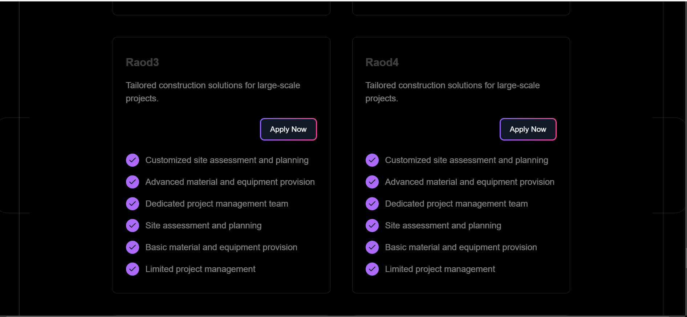

# Road Construction Expense Monitoring System

## Project Overview

The Road Construction Expense Monitoring System is a comprehensive tool designed to track and manage expenses related to road construction projects. This system provides a detailed view of project spending and resource allocation, ensuring accurate financial management throughout the project's lifecycle.


## Project Dependencies

1. **bcryptjs (v2.4.3):**
   - **Purpose:** Library for hashing and salting passwords.
   - **Usage:** Securely store user passwords in the database.

2. **cookie-parser (v1.4.6):**
   - **Purpose:** Middleware for parsing cookies in Express.js.
   - **Usage:** Handle cookies and extract information from them.

3. **dotenv (v16.3.1):**
   - **Purpose:** Zero-dependency module to load environment variables from a `.env` file.
   - **Usage:** Manage environment variables, such as database connection strings or API keys.

4. **express (v4.18.2):**
   - **Purpose:** Web application framework for Node.js.
   - **Usage:** Core framework for building the web server and handling HTTP requests and responses.

5. **jsonwebtoken (v9.0.2):**
   - **Purpose:** Library for creating and verifying JSON Web Tokens (JWT).
   - **Usage:** Secure communication between the server and clients, often for user authentication.

6. **mongoose (v8.0.2):**
   - **Purpose:** MongoDB object modeling tool designed for Node.js.
   - **Usage:** Interact with MongoDB databases, define schemas, and perform database operations.

7. **nodemon (v3.0.2):**
   - **Purpose:** Utility that monitors for changes in the Node.js application and automatically restarts the server.
   - **Usage:** Streamline the development process by auto-restarting the server on file changes.

## Installation

To install the project dependencies, run the following command:

```bash
npm install
```

This command will install all the dependencies listed in the `package.json` file.

## Running the Application

To start the application in development mode with automatic restarts (using `nodemon`), use:

```bash
npm run dev
```

This script is configured in the `package.json` file to use `nodemon` for development.

## Project Features

- **Expense Tracking:** Monitor and manage expenses for road construction projects.
- **User Authentication:** Secure login and registration using JWT and bcryptjs.
- **Environment Management:** Easily configure environment variables with dotenv.
- **Database Operations:** Efficiently interact with MongoDB using Mongoose.

## Contributing

Feel free to contribute to this project by submitting issues or pull requests. Please ensure that your contributions adhere to the project's coding standards and guidelines.

## License

This project is licensed under the MIT License. See the `LICENSE` file for details.
Absolutely! Contributing to open-source projects is a great way to improve your skills and help others. Here’s how you can contribute to the Road Construction Expense Monitoring System or similar projects:

### How to Contribute

1. **Fork the Repository**:
   - Click the "Fork" button on the top right of the repository page on GitHub. This creates a copy of the repository under your GitHub account.

2. **Clone Your Fork**:
   - Clone your forked repository to your local machine to start working on it:

     ```bash
     git clone https://github.com/your-username/repository-name.git
     ```

   - Replace `your-username` with your GitHub username and `repository-name` with the name of the repository.

3. **Create a New Branch**:
   - It's a good practice to create a new branch for your changes:

     ```bash
     git checkout -b your-branch-name
     ```

   - Replace `your-branch-name` with a descriptive name for the branch (e.g., `fix-typo` or `add-new-feature`).

4. **Make Your Changes**:
   - Edit, add, or delete files as needed for your contribution.
   - Test your changes thoroughly to ensure they work as expected.

5. **Commit Your Changes**:
   - Stage and commit your changes with a descriptive message:

     ```bash
     git add .
     git commit -m "Your descriptive commit message"
     ```

6. **Push Your Changes**:
   - Push your changes to your forked repository on GitHub:

     ```bash
     git push origin your-branch-name
     ```

7. **Create a Pull Request**:
   - Go to the original repository where you want to contribute.
   - You will usually see a prompt to create a pull request from your recently pushed branch. Click on "Compare & pull request."
   - Add a description of your changes and submit the pull request.

8. **Engage with Feedback**:
   - The project maintainers may provide feedback on your pull request. Address any comments or requested changes.
   - Make any additional changes locally, commit them, and push them to update the pull request.

### Contributing Guidelines

Before contributing, check if the repository has a `CONTRIBUTING.md` or other documentation outlining specific guidelines for contributions. Follow these guidelines closely to ensure that your contributions are aligned with the project’s standards.

### Examples of Contributions

- **Bug Fixes**: Identify and fix bugs or issues in the code.
- **New Features**: Add new functionality or features.
- **Documentation**: Improve or update documentation, including README files.
- **Code Improvements**: Refactor code for better performance or readability.
- **Testing**: Write or enhance tests to ensure code reliability.

### Contact and Support

If you have questions or need help, look for a `CONTACT.md` or `SUPPORT.md` file in the repository. You can also open an issue on the GitHub repository to ask questions or discuss potential changes.

Contributing to projects is a rewarding experience, and your efforts can make a significant impact. Happy coding!



